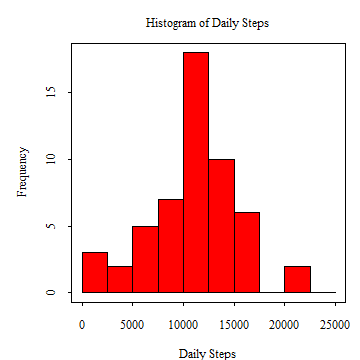
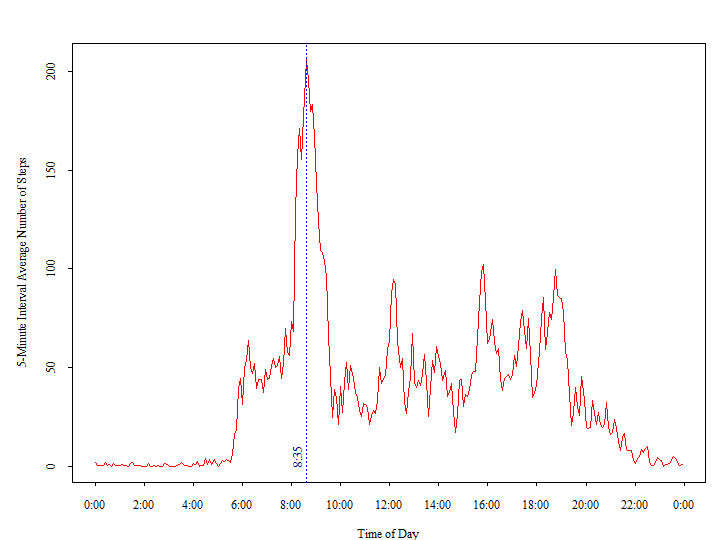
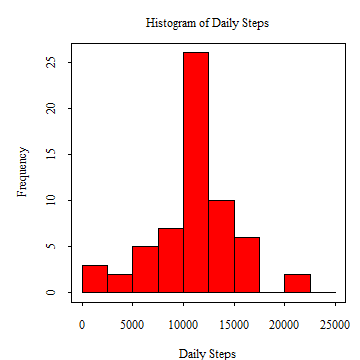
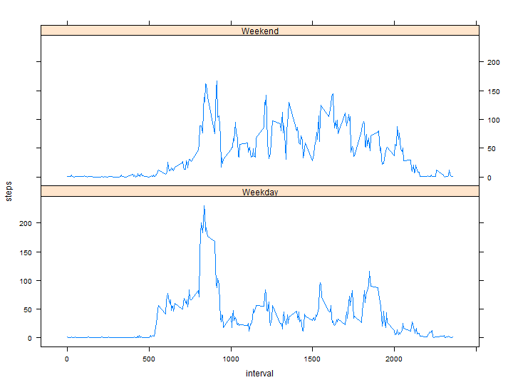

## Setup the R environment

The following **(i)** removes (almost) everything in the working `R` environment, **(ii)** sets `scipen` option such that numeric values in fixed notation (e.g., 100,000) are preferred to those in exponential notation (1.0 x 10^6 ), **(iii)** loads the contributed package `lattice`, **(iv)** loads quietly the contributed `R` package `dplyr`, **(v)** loads the contributed `R` package `knitr` and sets its global option `echo` for all `R` code chunks to `TRUE`, and **(vi)** sets the working directory. Unless otherwise specified, `opts_chunk$set(echo=TRUE)` requires `R` through `knitr` to always include the `R` source code in the output file. 


```r
# REMOVE ALMOST EVERYTHING IN THE WORKING ENVIRONMENT
rm(list=ls(all=TRUE))
# SET scipen SUCH THAT NUMERIC VALUES IN FIXED NOTATION ARE PREFERRED TO THOSE 
# IN EXPONENTIAL NOTATION
options(scipen = 100)
# LOAD lattice PACKAGE
library(lattice)
# LOAD THE dplyr PACKAGE QUIETLY
suppressMessages(suppressWarnings(require(dplyr)))
# LOAD THE knitr PACKAGE
library(knitr)
# SET GLOBAL OPTION echo TO TRUE
opts_chunk$set(echo=TRUE)
# SET WORKING DIRECTORY
setwd("C:/Work/Personal/Personal/Coursera/5-ReproducibleResearch/PeerAssessment1")
```


## Loading and preprocessing the data

Since unzipping the `zip` archive is runtime cheap, the `csv` input file is reinitialized every time the `html` file is generated. The `date` variable in the `csv` input file is transformed and converted from a `character` field to a `date` via `as.Date`. The transformed data set is explored via the `str`, `head` and `summary` commands.


```r
# UNZIP THE ARCHIVE
unzip(zipfile="activity.zip")
# LOAD THE INPUT FILE
data <- read.table(file="activity.csv", header=TRUE, sep=",", 
	colClasses=c("numeric","character","integer"))
# TRANSFORM DATA
data[,2] <- as.Date(data[,2], "%Y-%m-%d")
# EXPLORE DATA
str(data)
```

```
## 'data.frame':	17568 obs. of  3 variables:
##  $ steps   : num  NA NA NA NA NA NA NA NA NA NA ...
##  $ date    : Date, format: "2012-10-01" "2012-10-01" ...
##  $ interval: int  0 5 10 15 20 25 30 35 40 45 ...
```

```r
head(data, 3)
```

```
##   steps       date interval
## 1    NA 2012-10-01        0
## 2    NA 2012-10-01        5
## 3    NA 2012-10-01       10
```

```r
summary(data)
```

```
##      steps             date               interval     
##  Min.   :  0.00   Min.   :2012-10-01   Min.   :   0.0  
##  1st Qu.:  0.00   1st Qu.:2012-10-16   1st Qu.: 588.8  
##  Median :  0.00   Median :2012-10-31   Median :1177.5  
##  Mean   : 37.38   Mean   :2012-10-31   Mean   :1177.5  
##  3rd Qu.: 12.00   3rd Qu.:2012-11-15   3rd Qu.:1766.2  
##  Max.   :806.00   Max.   :2012-11-30   Max.   :2355.0  
##  NA's   :2304
```


## What is mean total number of steps taken per day?

The following R code chunks **(i)** remove all records with missing entries from the data set put together in the preceding step (via `na.omit`), **(ii)** summarize through summation the total daily steps taken by the anonymous respondent (via `group_by` and `summarise_each`), **(iii)** create the histogram of the total number of steps taken each day (via `hist`), and **(iv)** calculate the mean and the median of the total number of steps taken per day (via `summarise`).


```r
# REMOVE NA RECORDS
data1 <- na.omit(data)
# CALCULATE TOTAL NUMBER OF STEPS TAKEN PER DAY
data11 <- data.frame(summarise_each(group_by(data1, date), funs(sum), steps))
# CREATE HISTOGRAM
par(mar=c(4,5,3,1), tcl=-0.25, family="serif")
hist(data11[,2], breaks= seq(0,25000,2500), xlab="Daily Steps", main="Histogram of Daily Steps", 
	font.main=1, cex.main=1.0, col=2, border=1)
box()
```

 

```r
# CALCULATE THE MEAN AND MEDIAN OF THE TOTAL NUMBER OF STEPS TAKEN PER DAY
data12 <- data.frame(summarise(data11, mean=mean(steps), median=median(steps)))
data12
```

```
##       mean median
## 1 10766.19  10765
```

The mean and the median of the total number of steps taken per day are 10766.19 and 10765, respectively.


## What is the average daily activity pattern?

To create the time series plot, the following high-level steps are followed: 

**(i)** All records with missing entries are removed from the original data set via `na.omit`,

**(ii)** The average number of steps by each of the 5-minute intervals is computed via `summarise_each` and `group_by` from the package `dplyr`,

**(iii)** The plot display is enhanced by creating two more variable. The `x` variable helps position the points along the x-axis. The `labels` variable helps create eye pleasant annotations along the x-axis. 


```r
# REMOVE NA RECORDS
data2 <- na.omit(data)
# CALCULATE AVERAGE NUMBER OF STEPS TAKEN PER EACH OF THE 5 MINUTE INTERVALS ACROSS ALL DAYS
data21 <- data.frame(summarise_each(group_by(data2, interval), funs(mean), steps))
# ADD COLUMNS NEEDED TO PLOT THE TIME SERIES DATA
data21 <- transform(data21, x=seq(from=0, by=5, length.out=nrow(data21)), 
	labels=paste(data21[,1]%/%100, formatC(data21[,1]%%100, width=2, format="d", flag="0"), sep=":"))
# CREATE THE TIME SERIES PLOT
par(mar=c(4,5,3,1), tcl=-0.25, family="serif")
plot(data21[,3], data21[,2], xlab="Time of Day", ylab="5-Minute Interval Average Number of Steps",
	col=2, type="l", xaxt="n")
tmp <- seq(from=0, by=120, length.out=13)
axis(1, at=tmp, labels = c(as.character(data21[data21[,3] %in% tmp,4]),"0:00"))
# IDENTIFY THE 5-MINUTE INTERVAL WITH THE MAXIMUM AVERAGE NUMBER OF STEPS
max5i <- data21[data21[,2]==max(data21[,2]),]
max5i
```

```
##     interval    steps   x labels
## 104      835 206.1698 515   8:35
```

```r
# IDENTIFY X-POSITION OF THE MAX ON THE CHART
abline(v=max5i[1,3], col="blue", lty=3, lwd=1.75)
text(x=max5i[1,3], y=10, labels=as.character(max5i[1,4]), col="darkblue", adj=c(1,-0.5), srt=90)
```

 

As per the above, the most walked 5-minute interval for this respondent is the interval that starts at 8:35. On average, within this interval, the respondent takes about 206.2 steps.


## Imputing missing values

**(Verbiage provided at the bottom of the section)**


```r
# CALCULATE AND REPORT THE TOTAL NUMBER OF ROWS WITH MISSING ENTRIES
trm <- nrow(data[!complete.cases(data),])
trm
```

```
## [1] 2304
```

```r
# DEVISE FILL IN STRATEGY: REMOVE NA RECORDS
tmp <- na.omit(data)
# DEVISE FILL IN STRATEGY: AVERAGE NUMBER OF STEPS TAKEN PER EACH OF THE 5 MINUTE INTERVALS ACROSS ALL DAYS
tmp <- data.frame(summarise_each(group_by(tmp, interval), funs(mean), steps))
# CREATE NEW DATA SET
data3 <- select(mutate(inner_join(x=data, y=tmp, by="interval"), 
	steps=ifelse(is.na(steps.x), steps.y,steps.x)),steps, date, interval)
# CALCULATE TOTAL NUMBER OF STEPS TAKEN PER DAY
data31 <- data.frame(summarise_each(group_by(data3, date), funs(sum), steps))
# CREATE HISTOGRAM
par(mar=c(4,5,3,1), tcl=-0.25, family="serif")
hist(data31[,2], breaks= seq(0,25000,2500), xlab="Daily Steps", main="Histogram of Daily Steps", 
	font.main=1, cex.main=1.0, col=2, border=1)
box()
```

 

```r
# CALCULATE THE MEAN AND MEDIAN OF THE TOTAL NUMBER OF STEPS TAKEN PER DAY
data32 <- data.frame(summarise(data31, mean=mean(steps), median=median(steps)))
data32
```

```
##       mean   median
## 1 10766.19 10766.19
```

There are 2304 rows in the `Activity Monitoring` data set that have missing entries in the `steps` column. All missing values were imputed using the average number of steps taken in the corresponding 5-minute intervals. The new data set was created using the commands `inner_join`, `mutate` and `select` from the contributed package `dplyr`. For this data set, the mean and median total number of steps taken per day are both 10766.19. Effectively, this means that the total number of steps taken per day are arranged symmetrically around the median (which is an interesting result but not completely unexpected). Compared to the estimates from the first part of the assignment, only the median changed slightly. The imputation of the missing values resulted in this case in a slight increase in the median from a value of 10765 to a value of 10766.19.

## Are there differences in activity patterns between weekdays and weekends?

To investigate whether or not there are differences between the weekday/weekend activity patterns, a new 2-level factor variable `wkd` (Weekend/Weekday) was added to the filled-in missing value data set. In a subsequent step, the average number of steps taken per each of the 5 minute intervals was computed by weekdays and weekends via `group_by` and `summarise_each` commands from the contributed package `dplyr`. As shown in the figure below, there are obvious differences between the activity patterns in weekdays and weekends. For example, in the second part of the day, the subject of this study takes more steps during the weekends than during the weekdays.


```r
# ADD WEEKDAY/WEEKEND FACTOR TO THE DATA SET
data4 <- data.frame(select(mutate(data3, weekday=weekdays(date),
	wkd=as.factor(ifelse(weekday %in% c("Saturday","Sunday"), "Weekend", "Weekday"))),
	steps, date, interval, wkd))
# CALCULATE AVERAGE NUMBER OF STEPS TAKEN PER EACH OF THE 5 MINUTE INTERVALS ACROSS ALL WEEKDAY/WEEKEND DAYS
data41 <- data.frame(summarise_each(group_by(data4, wkd, interval), funs(mean), steps))
# CREATE THE PLOT WITH THE AVERAGE NUMBER OF STEPS BY WEEKDAYS/WEEKENDS
xyplot(steps~interval|wkd, data=data41, type="l", layout=c(1,2))
```

 
